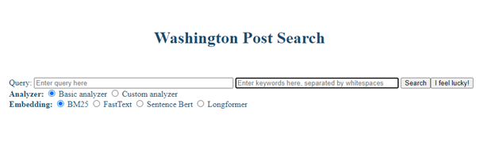
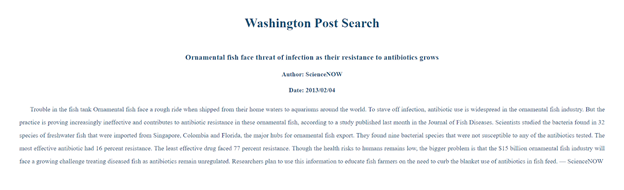

# ElasticSearch on TREC: Eating Invasive Species
This repository is for the final project of COSI 132A, Information Retrieval. We used TREC as our annotated dataset to build a news article search engine that can retrieve documents relevant to a user query on a topic. 

System demo, searching for articles related to our topic of interest, "Eating Invasive Species":


## Basic Information
Team members: Yonglin Wang,  Xiaoyu Lu, Yun-Jing Lee, Ruobin Hu

Team member submitting code: Xiaoyu Lu

### Project Summary
In this TREC-based information retrieval project, we experimented with computer-assisted query expansion, reranking with Longformer embedding, keyword bolding, and web UI improvements. This project is built based on a ES system we previously developed in class, which uses BM25 and a custom analyzer for document retrieval and fastText and sBERT embedding for reranking. 

### Team Member Contribution
This amazing project cannot be put together without the contribution of each group member! The order below corresponds to the order in which we speak in [our final presentation](https://github.com/Xiaoyu-Lu/ElasticSearch_WAPO/blob/main/report/final-presentation.pdf). 

**Yonglin**: Longformer, query expansion, search by keyword

**Yun-Jing**: corpus-wide and topic-level data analysis

**Ruobin**: web UI, on call CSS styling

**Xiaoyu**: text bolding algorithm, database

### Documentations
Here is a list of progress reports, sorted by recency:
1. [Final project report](https://github.com/Xiaoyu-Lu/ElasticSearch_WAPO/blob/main/report/final-presentation.pdf)
2. [Second progress report](https://github.com/Xiaoyu-Lu/ElasticSearch_WAPO/blob/main/report/second-progress-report.pdf)
3. [First progress report](https://github.com/Xiaoyu-Lu/ElasticSearch_WAPO/blob/main/report/first-progress-report.pdf)

To request access to [our group project Drive folder](https://drive.google.com/drive/u/1/folders/1tzpMxcXucRHe8GyKHFNX4gqzcEOQo3vN) containing all the documentations and essential datasets, please contact one of the group members.

### TREC Topic for Evaluation: Eating Invasive Species
In this project, we specifically evaluated the effect of our approaches on one of [TREC 2018 topics](https://trec.nist.gov/data/core/topics2018.txt), #805, which includes the following fields:

```xml
<top>
<num> Number: 805 </num>
<title>
eating invasive species
</title>
<desc> Description:
Would eating invasive species be a viable method of controlling/eradicating them?
</desc>
<narr> Narrative
Relevant documents identify invasive species in the U.S. that can be eaten by human beings and discuss the likelihood of controlling the species through consumption.  Comments on the color, taste, texture, or other culinary qualities of particular invasive species are also relevant.
</narr>
</top>
```

## Queries
#### Queries used in term expansion

Each query below builds on the previous one; additional terms are underlined.

- **Default Title**: eating invasive species

- **Wiki** (adding Wikipedia species expansion): eating invasive species <u>Kudzu Zebra mussel Asian carp Snakehead Giant African land snail Lionfish</u>
- **Wiki + Cook** (adding GloVe informed synonym for *eating*): eating <u>cooking</u> invasive species Kudzu Zebra mussel Asian carp Snakehead Giant African land snail Lionfish
- **Wiki + Cook + NL (Natural Langauge)** (adding functional words to reranking query): eating <u>and</u> cooking invasive species <u>such as</u> Kudzu Zebra mussel Asian carp Snakehead Giant African land snail <u>and</u> Lionfish

For more queries, see [our discussion in the final report](https://github.com/Xiaoyu-Lu/ElasticSearch_WAPO/blob/main/report/final-presentation.pdf).

## Output

#### Queries used in term expansion

In the following table, we can see that each new technique proposed brings improvement in two or all of the scores. All best results are from using custom analyzer and BM25 for retrieval and sBERT for reranking. 

| Score Type | Wiki + Cook + NL rerank | Wiki + Cook | Wiki  | PA Best (Default Title) |
| ---------- | ----------------------- | ----------- | ----- | ----------------------- |
| AP         | 0.837                   | 0.772       | 0.659 | 0.533                   |
| Precision  | 0.5                     | 0.5         | 0.45  | 0.35                    |
| NDCG@20    | 0.917                   | 0.836       | 0.772 | 0.695                   |

#### Average Precision by Topic Number

The result for our Average Precision of retrieving with title text for each TREC topic: 


From this graph, we can see that no one single embedding method outperforms others across topics. Which embedding to use for reranking seems to depend on the content of the query. Therefore, in the future, it would be beneficial to cluster queries based on their content and other characteristics and determine which embedding method to apply to which cluster of queries. 

#### Web UI Home Page

Below is the screenshot for our Web UI Home Page, note that "I feel lucky!" will choose a random Analyzer + Embedding combination for the user, in order to reduce the friction in deciding on a combination:



#### Web UI Result Page

Below is the screenshot for our Web UI Result Page, where we first retrieve by the keyword "fish" and rerank the retrieved documents with "eating invasive species", note that 

1. the title link shows underline when cursor hovers over.
2. the snippets highlights the keywords in the reranking query, regardless of morphological inflections (e.g. "eat" is also highlighted while only "eating" is present in the query)


#### Web UI Result Page with Debug Mode

Below is the screenshot for our Web UI Result Page with Debug Mode using *Wiki + Cook* query for retrieval and *Wiki + Cook + NL* query for reranking, note that 

1. AP (Average Precision), Precision, and NDCG (Normalized Discounted Cumulative Gain) are now shown.
2. relevance annotations (805-1 = relevant to Topic 805; 805-2 = highly relevant to Topic 805; 805-0, other topic ID, or no annotation = not relevant to Topic 805) now appears on the right of the title link.


#### Web UI Document Page

Below is the screenshot for our Web UI Doc Page, where we display the content of the WAPO article after the user clicks on its title on the result page. 




## Results
For a detailed result discussion, see [our discussion in the final report](https://github.com/Xiaoyu-Lu/ElasticSearch_WAPO/blob/main/report/final-presentation.pdf).

### Retrieval Approaches
* Taking intersections on Wikipedia data helps narrow down keywords
* Reranking with a different text might help, especially when expanding query terms
* Implementing Longformer to include more document texts might be helpful, depending on the topic
### Corpus-wide Comparison and Analysis
* Longformer *sometimes* helps with reranking BM25 results
### Web UI
* Separate input texts for retrieving and reranking
* Keyword bolding algorithm is much harder than it looks
* User-centric UI design


## Dependencies and Build Instructions
### 1. Activate Environment
This repository is Python-based, and **Python 3.9** is recommended.

*Remember to always activate your virtual environment first.* You can create a virtual environment using either [venv](https://packaging.python.org/guides/installing-using-pip-and-virtual-environments/#creating-a-virtual-environment) or [conda](https://conda.io/projects/conda/en/latest/user-guide/tasks/manage-environments.html#creating-an-environment-with-commands).

### 2. First-time Running
The required packages are listed in [requirements.txt](requirements.txt).

Run the following subsections only once, when you set up the project for the first time.
#### 2.1 Install Dependencies
```shell script
pip install -r requirements.txt
```
#### 2.2 Set up ElasticSearch Server

After you install elasticsearch-dsl-py package, add the following code at the end of `elasticsearch_dsl/query.py`:
```python
class ScriptScore(Query):
    name = "script_score"
    _param_defs = {"query": {"type": "query"}}
```
Download ES from https://www.elastic.co/downloads/past-releases#elasticsearch. Make sure you are choosing Elasticsearch 7.10.2 (used for scoring the assignment). To start the ES engine:

```shell script
cd elasticsearch-7.10.2/
./bin/elasticsearch
```

#### 2.3 Download all Data

Your [data/](data/) directory should contain the following files, so that you can run the system properly:

```
data
├── docs50k_whole.db
├── subset_wapo_50k_sbert_ft_lf_filtered.jl
├── topics2018.xml
└── wiki-news-300d-1M-subword.vec
```

You can download ```wiki-news-300d-1M-subword.vec``` at any time  [here](https://dl.fbaipublicfiles.com/fasttext/vectors-english/wiki-news-300d-1M-subword.vec.zip).

After granted access by one of our team members, you can access:

[docs50k_whole.db](https://drive.google.com/uc?export=download&id=1lfXuiI4oMj37p0_hbzS593LoQuy9zoZp): database for the keyword bolding algorithm

[subset_wapo_50k_sbert_ft_lf_filtered.jl](https://drive.google.com/file/d/1h1LDoLRBgQgUJH5tbWuBlG-dparXy6f-/view?usp=sharing): JSON line file containing a subset of documents in TREC, including their sBERT, fastText, and Longformer vectors

#### 2.4 Build Index

To load wapo docs into the index called "wapo_docs_50k_lf", run:
```shell script
python load_es_index.py --index_name wapo_docs_50k_lf --wapo_path data/subset_wapo_50k_sbert_ft_lf_filtered.jl
```

#### 2.5 Notes on Creating the datasets

This is just for documentation purpose. You **DO NOT** need to run the code described here, since your ```data/``` directory should have the datasets already by now. 

1. **Dataset**: ```subset_wapo_50k_sbert_ft_lf_filtered.jl``` 

   **Code for creating**:  [longformer_vectorization](longformer_vectorization/)

   **Instructions**: see [longformer_vectorization](longformer_vectorization/); GPU resources are recommended.

2. **Dataset**: ```docs50k_whole.db``` 

   **Code for creating**: [db.py](db.py)

   **Instructions**:

   To get a taste of the time it takes (~1 hour) to build db from all documents, you can create the database by running 

   ```shell
   python db.py
   ```

   Make sure the code under ```if __name__=="__main__":``` in  [db.py](db.py) is all uncommented before creating databases.

### 3. Setting up ElasticSearch Server

If you haven't done so already, run the following command to start an ES server:
```shell script
cd elasticsearch-7.10.2/
./bin/elasticsearch
```

### 4. Setting up Embedding Servers

You don’t need to download any pretrained model for sentence transformers, it will be loaded the first time it's called.

- Load fasttext model (click [this](https://dl.fbaipublicfiles.com/fasttext/vectors-english/wiki-news-300d-1M-subword.vec.zip) link to download `.vec` file first,  then put it into `data/` folder):

```shell script
python -m embedding_service.server --embedding fasttext  --model data/wiki-news-300d-1M-subword.vec
```

- Load sbert model:

```shell script
python -m embedding_service.server --embedding sbert --model msmarco-distilbert-base-v3
```

- Load longformer model (download for the first time):

```shell script
python -m embedding_service.server --embedding longformer --model allenai/longformer-base-4096
```

### 5. Running the Programs

- For Evaluation: 
    Change ```TOPIC_ID``` to the topic ID you want to evaluate.
    ```shell
    sh scirpts.sh
    ```

- For the web app:

    Run the app, then type http://127.0.0.1:5000/ in the browser to view the web application.
    
    ```shell script
    python app.py 
    ```
    If you'd like to see scores for Topic 805 and annotations on the result page, run
    ```shell script
    python app.py --debug 
    ```

## How to Use the Search System
Our BM25 retrieval system defaults to using keyword text and falls back to query text if no keyword text is provided. If neither keyword nor query text is provided, the program will jump back to home page.

Reranking will only be performed if query text is provided and reranking is based on query text only. 
### Case 1: Using both Query and Keywords
The top K results will be retrieved based on the keyword text and, if reranking, reranked based on the query text.
### Case 2: Using Query Text Only
The top K results will be retrieved based on the query text and, if reranking, reranked based on the query text as well.

This is the default behavior in PA5. 
### Case 3: Using Keywords Only
The top K results will be retrieved based on the keyword text. 

Intuitively, no reranking will be performed even if a reranking method is specified. This means that if a user searches with only keywords and chooses fastText as the reranking method, the system will correct the reranking method to BM25 only (i.e. no reranking). 

